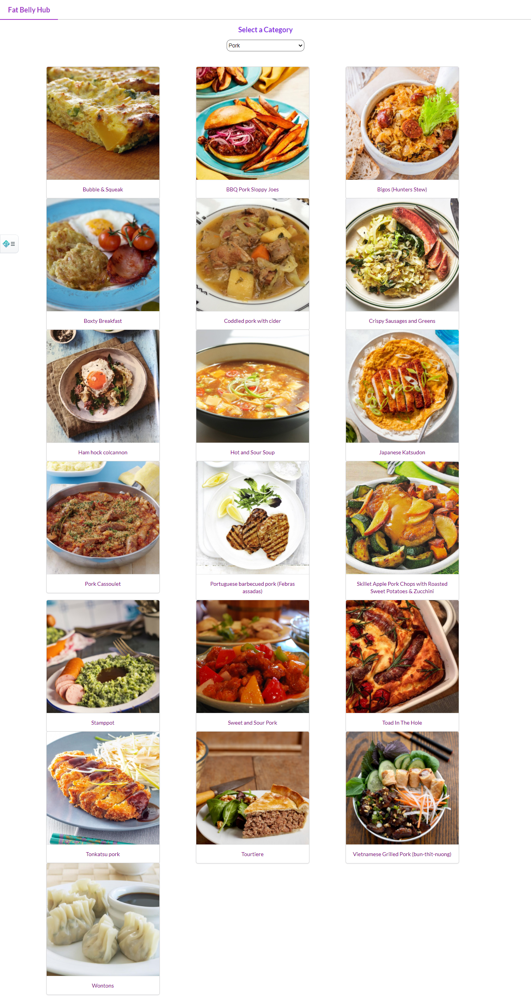
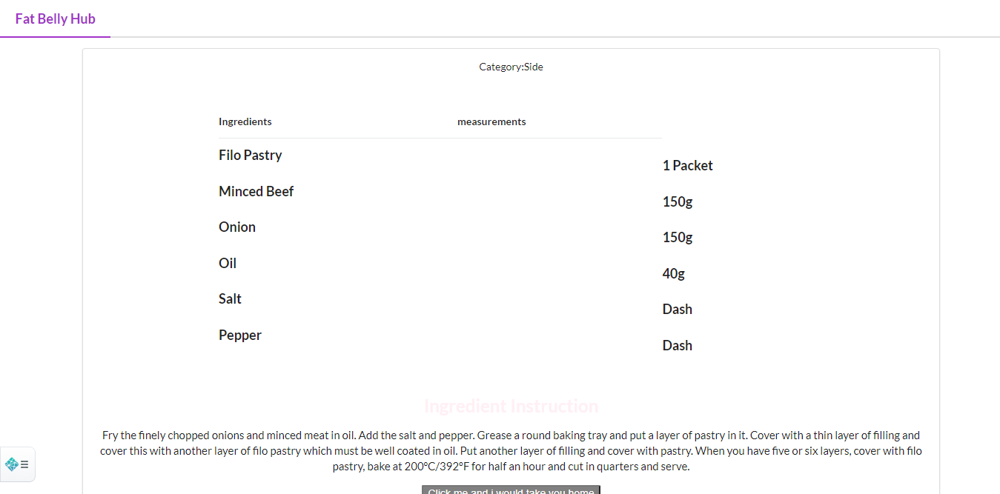

# fat belly-hub.
This is a simple web app built with redux,it returns meals,and their recipe ingredient based on what you are searching for within the categories available.

# Live demo link

# Screenshot of the Project

# Loom Video link

- [Loom video 1.](https://www.loom.com/share/9fc248d8f4544715a15821cff103becd)
- [Loom video 2.](https://www.loom.com/share/9574551f1a714beda38698f52ccf52c0)

# Getting Started with Create React App

This project was bootstrapped with [Create React App](https://github.com/facebook/create-react-app).

## In this project.

- React & Redux.
- TheMealDB API.
- Linters.
- Workflow.
- Netlify for deploy.

# How it's work.

- Go to [fat-belly-hub](https://github.com/wintan1418/fat-belly-hub/tree/fatbelly).

- Clone the repo: [https://github.com/wintan1418/fat-belly-hub/tree/fatbelly].

- Cd to the cloned repo.

- Open the terminal and type: npm install.

- YAY, now you can type npm start to see the work.

# Author
## **Oluwadare juwon**

- Github: [@Oluwadare Juwon](https://github.com/wintan1418)
- Linkedin: (www.linkedin.com/in/oluwintan)
- Twitter: [Oluwadare-juwon](https://twitter.com/@oluwadarejuwon)

## 🙋‍♂ show your support

give a ⭐️ if you like this project!

## 📝 license

This project is [MIT](LICENSE) licensed.